<p align="center">
  
</p>

<h1 align="center">Infra-Guard: Autonomous Observability Agent</h1>

<p align="center">
  <a href="LICENSE"></a>
  
  
  
</p>

<p align="center">
  
</p>

**Infra-Guard** is a production-grade autonomous agent designed to solve "alert fatigue" and fragmented logs in cloud-native environments. Powered by **LangGraph** and **Groq's LPU inference**, it performs near-instant root-cause analysis (RCA) on raw log streams.

---

## 🔥 Key Features

- **Autonomous RCA**: Automatically identifies failure patterns and synthesizes detailed Markdown reports.
- **Sub-Second Reasoning**: Leverages Groq (Llama 3.3 70B) for ultra-low latency analysis.
- **Stateful Workflow**: Uses LangGraph to manage multi-step reasoning traces and logical routing.
- **Security First**: Built-in protection against prompt injection and log volume overflows.
- **Production Ready**: FastAPI layer with Pydantic validation and detailed audit trails.

---

## 🏗️ Architecture & Flow

Infra-Guard follows a stateful, event-driven pattern managed by LangGraph.

```mermaid
flowchart LR
    INGEST["📥 Log Ingestion"] --> VAL["🛡️ Validation Node"]
    VAL --> DET["🔍 Anomaly Detection"]
    DET --> ROUTE{{"⚖️ Router"}}
    
    ROUTE -- "Score < 7" --> END_H["✅ System Healthy"]
    ROUTE -- "Score >= 7" --> RCA["🧠 RCA Synthesis"]
    RCA --> END_I["📋 Incident Report"]

    VAL -.- V1["Injection Shield"]
    DET -.- V2["Pattern Scanning"]
    RCA -.- V3["Remediation Steps"]

    style INGEST fill:#f9f9f9,stroke:#333,stroke-width:2px
    style VAL fill:#e1f5fe,stroke:#01579b,stroke-width:2px
    style DET fill:#fff3e0,stroke:#e65100,stroke-width:2px
    style ROUTE fill:#f3e5f5,stroke:#4a148c,stroke-width:2px
    style RCA fill:#ede7f6,stroke:#311b92,stroke-width:2px
    style END_H fill:#e8f5e9,stroke:#1b5e20,stroke-width:2px
    style END_I fill:#ffebee,stroke:#b71c1c,stroke-width:2px
```



1.  **Validate**: Ensures logs are well-formed, timestamped, and sanitized for injection.
2.  **Detect**: LLM assigned an anomaly score (1-10) and identifies non-obvious patterns.
3.  **Route**: Logic determines if the incident requires deeper synthesis.
4.  **Synthesize**: LLM generates a structured report with impact levels and remediation steps.

---

## 🛠️ Tech Stack

| Component | Technology | Role |
| :--- | :--- | :--- |
| **Orchestration** | [LangGraph](https://github.com/langchain-ai/langgraph) | Stateful Agent Coordination |
| **Inference** | [Groq](https://groq.com/) | Llama 3.3 70B LPU Reasoning |
| **API Layer** | [FastAPI](https://fastapi.tiangolo.com/) | High-Performance REST Interface |
| **Data Integrity** | [Pydantic](https://docs.pydantic.dev/) | Type safety & State Validation |
| **Development** | [uv](https://github.com/astral-sh/uv) | Dependency & Environment Management |

---

## 🚀 Getting Started

### 1. Prerequisites
- **Python 3.13+**
- **[uv](https://github.com/astral-sh/uv)** (Python package manager)
- **Groq API Key**

### 2. Installation
```bash
git clone https://github.com/your-username/infra-guard.git
cd infra-guard
cp .env.example .env
# Edit .env and add your GROQ_API_KEY
```

### 3. Run the Server
```bash
uv run python src/infra_guard/main.py
```

---

## 🔌 API Usage

### `POST /analyze`
Analyzes a stream of logs for anomalies.

**Request Body:**
```json
{
  "raw_logs": [
    {"service": "payment", "level": "ERROR", "message": "Connection refused"}
  ],
  "model": "llama-3.3-70b-versatile",
  "temperature": 0.1
}
```

**Response:**
```json
{
  "anomaly_score": 9,
  "verdict": "Incident Detected (score=9/10)",
  "reasoning_path": ["validate_logs_node", "anomaly_detection_node", "rca_synthesis_node"],
  "final_report": "## Root Cause Analysis Report...",
  "error_context": null
}
```

---

## 🛡️ Security & Robustness

- **Injection Shield**: XML-escaping on all log inputs prevents prompt injection.
- **Resource Guard**: Automatic truncation of log streams to 50 entries to protect context windows.
- **Fail-Fast**: Environment validation at startup ensures missing keys are caught immediately.
- **Observer Trace**: Every request is tagged with a unique `thread_id` for request correlation.

---

## ✅ Success Metrics (FRD)

- **Stability**: 100% of graph runs reach the END state regardless of LLM variability.
- **Latency**: End-to-end reasoning chain executes in **< 5 seconds** using Groq LPUs.
- **Code Quality**: Strict separation between graph logic, LLM prompts, and API endpoints.

---

## 🏗️ CI/CD

The project includes a **GitHub Actions CI** pipeline (`.github/workflows/ci.yml`) that automates:
- **Linting**: Powered by [Ruff](https://github.com/astral-sh/ruff).
- **Testing**: Full logic validation via [Pytest](https://docs.pytest.org/).

---

## 📜 License

This project is licensed under the [MIT License](LICENSE).
